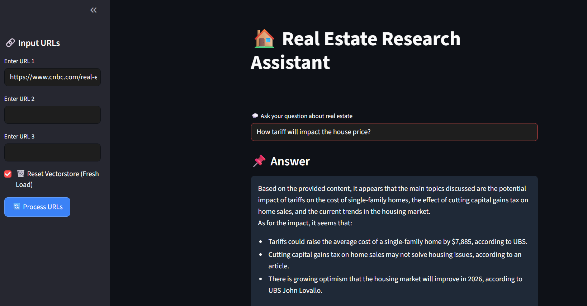

🏠 Real Estate Trends Assistant using GenAI + RAG
A modern Streamlit web app that answers real estate questions using Generative AI, LangChain, and Retrieval-Augmented Generation (RAG). It fetches, processes, and analyzes the latest real estate news from trusted Indian and global sources to help users stay informed and make data-backed property decisions.





🔗 Live Demo
Try the app live:
👉 Real Estate GenAI App (https://real-estate-rag-genai.streamlit.app/)


🔍🔍 Project Overview
This assistant leverages cutting-edge LLMs, RAG pipelines, and HuggingFace embeddings to provide intelligent, up-to-date answers based on live real estate news content.

What You Can Do:
💬 Ask smart questions like:

"How are interest rates impacting real estate in India?"

"Is Surat becoming a hot property market?"

📚 Get reliable answers backed by credible sources.

🌐 Use default news URLs or supply your own to customize the knowledge base.

📦---

## 🚀 Features

- 🔍 **Automated News Retrieval** from trusted real estate sources.
- 📄 **Intelligent Text Chunking** with LangChain.
- 🧠 **High-performance Embeddings** via HuggingFace Transformers.
- 🗃️ **Vector Storage & Retrieval** using FAISS.
- 🤖 **LLM Question Answering** via ChatGroq (LLaMA3).
- 🧼 **Custom Prompt Engineering** to enhance answer quality.
- 💻 **Streamlit UI** to interact with the assistant easily.


---


## 🧱 Tech Stack

| Component         | Tool/Library                       |
|------------------|-------------------------------------|
| Embeddings       | `HuggingFaceEmbeddings`             |
| Vector Store     | `FAISS`                            |
| LLM              | `ChatGroq (LLaMA3-8B)`              |
| Chunking         | `RecursiveCharacterTextSplitter`    |
| UI               | `Streamlit`                         |
| Scraping         | `requests`, `BeautifulSoup`         |
| Environment      | `Python 3.11`, `CUDA 12.1`, `torch` |

---


🛠 Getting Started
🔧 Requirements
Python 3.11+

CUDA 12.1+ (for optional GPU acceleration)

NVIDIA GPU with at least 4GB VRAM (recommended)


📥### 📥 Installation

1. **Clone the repo:**
   ```bash
      (https://github.com/Krushang010/real-estate-rag-genai.git)
2. **Install dependencies:**
   ```bash
   pip install -r requirements.txt


3. **Run the Streamlit app:**
   ```bash
   streamlit run app.py


🧠 Behind the Scenes
This app combines:

Smart scraping to collect news from real estate sources.

Document chunking to break down large articles.

Embeddings + FAISS to search and retrieve the most relevant chunks.

LLM with contextual prompts to generate human-like answers.

Streamlit for a seamless user experience.

